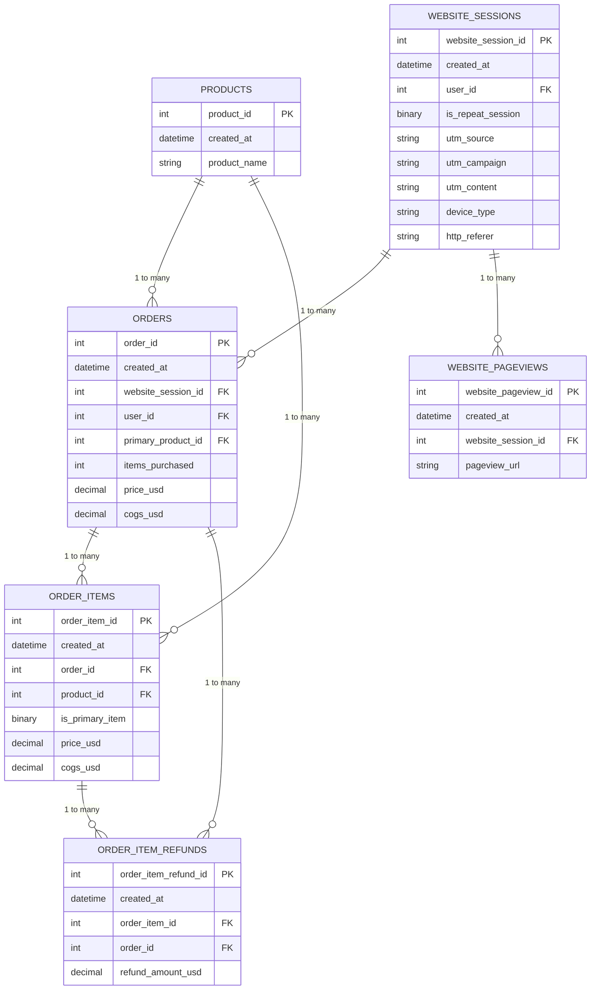

# Entity Relationship Diagram - Fuzzy Factory

## Overview
ERD showing the relationships between 6 core tables in the Fuzzy Factory database. The database tracks e-commerce transactions, product information, website analytics, and refunds.

## Diagram

## Key Relationships

| Relationship | Type | Description |
|---|---|---|
| PRODUCTS → ORDERS | 1 to Many | Each product can be a primary product in multiple orders |
| PRODUCTS → ORDER_ITEMS | 1 to Many | Each product appears in multiple order items |
| WEBSITE_SESSIONS → ORDERS | 1 to Many | Each session can generate multiple orders |
| WEBSITE_SESSIONS → WEBSITE_PAGEVIEWS | 1 to Many | Each session contains multiple page views |
| ORDERS → ORDER_ITEMS | 1 to Many | Each order contains multiple items |
| ORDERS → ORDER_ITEM_REFUNDS | 1 to Many | Each order can have multiple refunds |
| ORDER_ITEMS → ORDER_ITEM_REFUNDS | 1 to Many | Each order item can be refunded |

## Table Descriptions

### PRODUCTS
- Stores product information including ID, creation date, and product name

### ORDERS
- Tracks order transactions with totals (price and COGS), linked to website sessions and products

### ORDER_ITEMS
- Individual items within orders, with per-item pricing and refund tracking

### ORDER_ITEM_REFUNDS
- Refund records for individual order items, linked to both the item and order

### WEBSITE_SESSIONS
- User session tracking including marketing attribution (UTM parameters) and device type

### WEBSITE_PAGEVIEWS
- Page-level analytics, tracking user navigation within sessions</content>
<parameter name="filePath">c:\Users\tsaih\workspace\sample-data\Fuzzy_Factory\erd_diagram.md